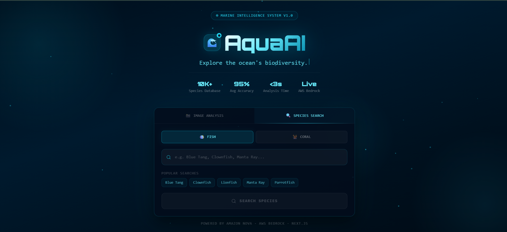

# 🌊 AquaAI v2 — Global Marine Intelligence Platform

AI-powered marine ecosystem intelligence — identify species, track invasive threats, monitor coral reef health, and contribute to global conservation. Built with Amazon Nova on AWS Bedrock.


## 🔗 Links
- **Live Demo**: https://aquaai-v2.vercel.app
- **Backend API**: https://aquaai-v2-backend.onrender.com/docs
- **v1 Demo Video**: https://www.youtube.com/watch?v=WuJ012c3D1c

---

## 🌟 What AquaAI v2 Does

AquaAI v2 is not just a fish identification app — it is a full global conservation intelligence platform that turns any photo into actionable marine science.

### Core Features

| Feature | Description |
|---------|-------------|
| 🐟 Fish Identification | Identify reef fish with confidence scoring, IUCN status, habitat, ecosystem role |
| 🪸 Coral Bleaching Intelligence | 4-stage bleaching system, Ocean Health Score, recovery probability, time to irreversible damage |
| 🦞 Marine Life Detection | Identify lobsters, crabs, turtles, octopus and more with health assessment |
| 🩺 Disease Detection | Detect barnacles, parasites, wounds, fin damage automatically |
| 💬 AI Chat Assistant | Deep-dive into any species via conversational Amazon Nova AI |
| 🔍 Species Search | Text-based search with full ecological profiles |

### New in v2

| Feature | Description |
|---------|-------------|
| 🌍 3D Species Tracker Globe | Interactive globe showing invasive sightings (red) and native habitat zones (green) |
| ⚠️ Invasive Species Detection | Real-time alerts with NOAA, WWF, GBRMPA research team contacts |
| 📊 Ocean Health Score | Single 0-100 score summarizing reef health for researchers and policymakers |
| 🔬 Research Team Contacts | Click any globe pin to see which organization is actively managing that location |
| 📍 Citizen Sighting Reports | Report invasive sightings with location search — 50km duplicate detection included |
| 🌡️ Bleaching Stage System | Scientific 4-stage classification used by NOAA and GBRMPA |
| 🏥 Recovery Probability | AI-calculated chance of reef recovery with time-to-irreversible estimate |
| 📋 Immediate Action System | Stage-specific emergency actions generated per coral analysis |

---

## 🌍 SDG Alignment

| SDG | How AquaAI Addresses It |
|-----|------------------------|
| **SDG 14** Life Below Water | Coral bleaching monitoring, invasive species tracking, reef health scoring |
| **SDG 13** Climate Action | Coral bleaching is a direct climate indicator — every analysis tracks ocean warming impact |
| **SDG 15** Life on Land | Biodiversity protection through IUCN status tracking and species range mapping |
| **SDG 4** Quality Education | Making professional marine biology accessible to students, divers, and citizen scientists |

---

## 🏗️ Architecture
```
User Upload / Search
        │
        ▼
┌─────────────────────────┐
│   Next.js Frontend      │  ← Vercel
│   globe.gl 3D Globe     │
└──────────┬──────────────┘
           │ REST API
           ▼
┌─────────────────────────┐
│   FastAPI Backend       │  ← Render
└──────┬──────────────────┘
       │
  ┌────┴──────────────────┐
  ▼          ▼            ▼
Stage 1    AWS S3      AWS DynamoDB
Vision     Images      Sightings +
Nova                   Reef History
  │ features
  ▼
Stage 2
Species ID + Health
Amazon Nova AI
  │
  ▼
Results + Globe + Dashboard
```

---

## 🛠 Tech Stack

| Layer | Technology |
|-------|------------|
| AI Model | Amazon Nova (multimodal) via AWS Bedrock Converse API |
| Image Storage | AWS S3 |
| Database | AWS DynamoDB |
| Backend | FastAPI + Python 3.11 + Pydantic v2 |
| Frontend | Next.js 16 + TypeScript + Tailwind CSS |
| 3D Globe | globe.gl + Three.js |
| Backend Deploy | Render |
| Frontend Deploy | Vercel |
| Fonts | Orbitron + JetBrains Mono |

---

## 🚀 Local Setup

### Prerequisites
- Python 3.11+
- Node.js 18+
- AWS account with Bedrock, S3, and DynamoDB enabled

### Backend
```bash
cd aquaAI-v2
python -m venv venv
venv\Scripts\activate     # Windows
source venv/bin/activate  # macOS/Linux
pip install -r requirements.txt
```

Create `.env`:
```env
AWS_ACCESS_KEY_ID=your_key
AWS_SECRET_ACCESS_KEY=your_secret
AWS_REGION=us-east-1
S3_BUCKET_NAME=your_bucket_name
AWS_PROFILE_ARN=your_bedrock_inference_profile_arn
```
```bash
uvicorn main:app --reload
# Docs at http://localhost:8000/docs
```

### Frontend
```bash
cd frontend
npm install
```

Create `frontend/.env.local`:
```env
NEXT_PUBLIC_API_URL=http://localhost:8000
```
```bash
npm run dev
# App at http://localhost:3000
```

### DynamoDB Setup

Create a table in AWS Console:
```
Table name:     aquaai-sightings
Partition key:  sighting_id (String)
Billing mode:   On-demand
```

---

## 📡 API Endpoints

| Method | Endpoint | Description |
|--------|----------|-------------|
| POST | `/analyze` | Upload image for species ID and health assessment |
| POST | `/search` | Search species by name |
| POST | `/chat` | Chat about an identified species |
| GET | `/sightings/{species}` | Get invasive sightings and native habitat for a species |
| POST | `/sightings/report` | Report a new invasive species sighting |
| GET | `/sightings/all/map` | Get all sightings for the globe |
| GET | `/health` | Health check |
| GET | `/docs` | Swagger UI |

---

## 📂 Project Structure
```
aquaAI-v2/
├── main.py
├── schemas.py
├── requirements.txt
├── runtime.txt
├── routers/
│   ├── analyze.py
│   ├── search.py
│   ├── chat.py
│   └── sightings.py          ← NEW
├── services/
│   ├── vision_service.py
│   ├── species_service.py    ← Updated with bleaching intelligence
│   ├── nova_client.py
│   └── s3_service.py
├── photos/
│   └── dash.png
└── frontend/
    ├── app/
    │   ├── page.tsx
    │   ├── results/page.tsx  ← Updated with coral dashboard
    │   └── globe/
    │       └── page.tsx      ← NEW
    └── components/
        ├── UploadCard.tsx
        ├── SearchCard.tsx
        ├── ChatPanel.tsx
        └── SpeciesGlobe.tsx  ← NEW
```

---

## 🌊 Conservation Impact

AquaAI v2 directly supports real conservation work:

- **Marine researchers** use the bleaching stage system and immediate action protocols
- **Conservation organizations** like NOAA, WWF, and GBRMPA are integrated directly into the platform
- **Citizen scientists** can report invasive sightings with 50km duplicate detection
- **Policymakers** get a single Ocean Health Score to inform environmental decisions
- **Students and educators** access professional-grade marine biology tools for free

With climate change threatening **90% of coral reefs by 2050** and invasive species costing the global economy **$423 billion annually**, real-time marine intelligence has never been more critical.

*AquaAI v2 — Where AI meets the Ocean 🌊*